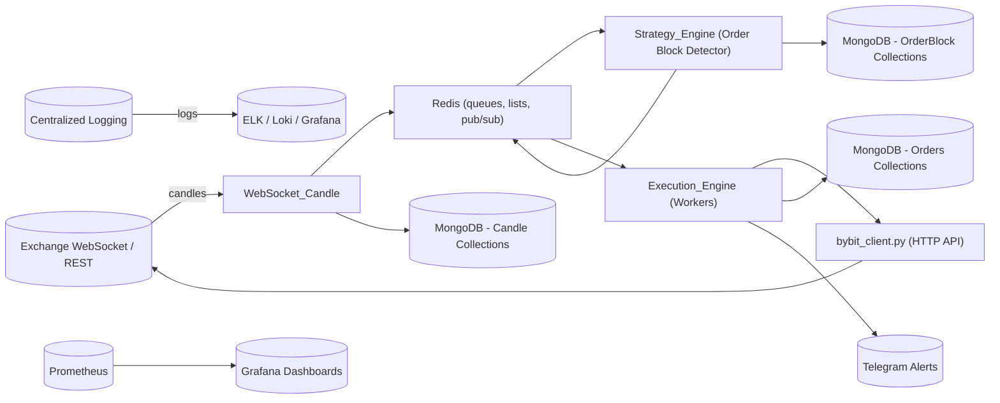
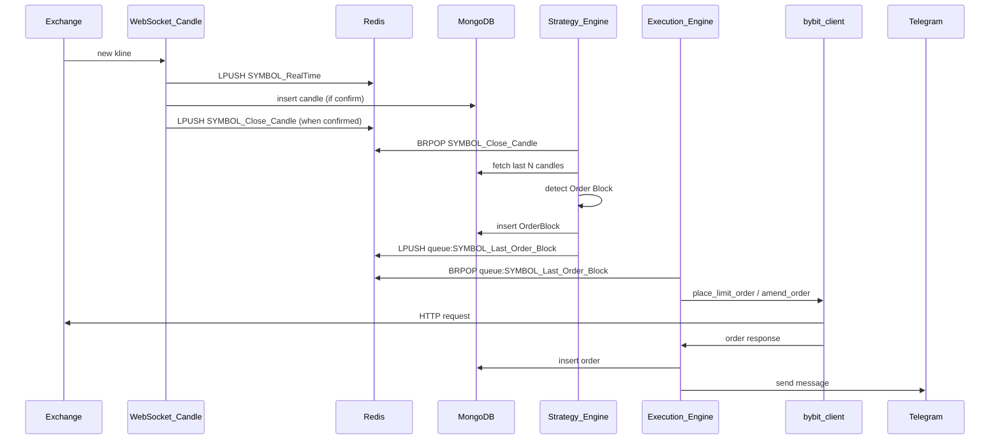

# System Design — Trading System (Full)

> وثيقة تصميم النظام الكاملة لبوت التداول (WebSocket ingestion → Strategy → Execution)

---

## نظرة عامة (High-level)

---

## مكوّنات النظام وتوضيح مسؤولياتها

* **WebSocket\_Candle.py (Ingestion)**

  * يتصل بـ WebSocket لـ Bybit ويشترك بمواضيع `kline`.
  * عند استقبال رسالة: يدفع آخر شمعة (RealTime) إلى Redis (LPUSH) ويحفظ الشموع المؤكدة في MongoDB.
  * يرسل إشعار قفل الشمعة عبر List/Queue (مثل `SYMBOL_Close_Candle`).

* **Redis**

  * يُستخدم كـ: قوائم (LPUSH/BRPOP) لتنظيم إشعارات الأحداث (Close candle, queues)، cache لآخر شمعة، و pub/sub محتمل.
  * يتم استخدام مفاتيح مثل `BTCUSDT_RealTime`, `BTCUSDT_Close_Candle`, `queue:BTCUSDT_Last_Order_Block`.

* **MongoDB**

  * تخزين شموع مُؤكَّدة في مجموعات لكل رمز.
  * تخزين Order Blocks (db\_OB).
  * تخزين الأوامر المرسلة/النتائج (db\_Orders).

* **Strategy\_Engine.py**

  * ينتظر إشارة إغلاق الشمعة (BRPOP على `SYMBOL_Close_Candle`).
  * يقرأ آخر N شموع من MongoDB، ينفذ `OrderBlock_Detector`، ويضغط نتائج OB إلى MongoDB وRedis، مع إرسال تنبيه Telegram.

* **Execution\_Engine.py**

  * Workers لكل رمز: BRPOP على قوائم إشعار Order Block أو Queue خاصة.
  * يحسب المخاطرة، يحسب الكمية والسعر باستخدام `bybit_client` helpers، ويرسل أوامر Limit/Modify.
  * يخزن نتائج الأوامر في MongoDB ويريح إشعارات للخطوات اللاحقة.

* **bybit\_client.py**

  * طبقة تجريد لطلبات HTTP إلى Bybit: place\_order, amend\_order, get\_wallet\_balance, get\_order\_history.
  * يحوي صيغ لتنسيق السعر/الكمية حسب `exchange_info.json`.

* **Alerts & Notifications**

  * Telegram bot لإرسال تنبيهات عند اكتشاف Order Block أو عند تنفيذ أمر.

* **Observability**

  * Centralized logs (file logs → ELK / Loki)
  * Metrics: Prometheus metrics (workers alive, queue length, processing latency, failed API calls). Dashboards on Grafana.
  * Alerts: عند ارتفاع طول الطوابير، فشل WebSocket، تكرار أخطاء API، أو خسارة رصيد.

* **Infra / Deployment**

  * كل خدمة داخل Docker container.
  * تشغيل على Kubernetes (preferred) أو docker-compose for small setups.
  * تصاميم ReplicaSets: WebSocket\_Candle (1 primary + hot-standby), Strategy & Execution scalable horizontally (HPA based on queue length/CPU).
  * Secrets stored in Vault / K8s secrets (API keys, DB creds).

---

## تتابع الحدث (Sequence) - عندما تُغلق شمعة

---

## نقاط القوة، القابلية للتوسع واعتبارات الفشل

* **Scalability**

  * Execution & Strategy قابلان للتمدد أفقياً. استخدم autoscaling based on Redis queue length.
  * MongoDB: read-replicas لسرعة القراءة عند استعلام الشموع.
  * Redis clustered لو احتجت high throughput.

* **Fault tolerance**

  * WebSocket\_Candle: إعادة محاولة الاتصال مع backoff، hot-standby instance تعمل على نفس الـ topics (مع coordination لمنع التكرار: leader election أو stream partitioning).
  * Ensure idempotency عند إدخال DB: وضع فهرس فريد على `Open_time` لكل مجموعة لتجنّب التكرار.
  * Durable queues: استخدام RPUSH/BRPOP مع acknowledgement pattern (أو استخدام stream مثل Redis Streams أو Kafka إذا احتجت garantied-processing).

* **Consistency**

  * بالنسبة لقراءة الشموع، Strategy يجب أن يعتمد على MongoDB لأن Redis قد يحوي بيانات غير مكتملة.

---

## مقاييس ومراقبة مُقترحة (Key Metrics)

* WebSocket: اتصال ناجح/فاشل، متوسط دوبلاغ (latency) بتلقي الرسائل.
* Redis: طول قوائم `queue:*`, معدل BRPOP success, متوسط زمن الانتظار.
* Execution: عدد الأوامر المرسلة / فشلها، average placement latency، تعديل الأوامر.
* Strategy: عدد Order Blocks المكتشفة يومياً، false positives ratio (من تجربة المستخدم).
* Financial: Exposure, P\&L per-symbol, walletBalance.

---

## إجراءات تشغيلية وRunbook مختصر

* إذا فقد WebSocket الاتصال → تحقّق من الشبكة وابدأ خدمة WebSocket جديدة. راجع logs (websocket\_trace).
* إذا تراكمت رسائل في `queue:...` لأكثر من X دقيقة → زيادة عدد عُمال Execution أو تعطيل مؤقت لإيقاف تنفيذ أوامر حتى التحقيق.
* فشل في وضع أمر (API error) → أعد المحاولة مع backoff، وإذا استمر أرسل تنبيه Telegram وارجع السجل.

---

## تحسينات مستقبلية (Roadmap)

1. استبدال Redis lists بـ Redis Streams أو Kafka لمعالجة مضمونة (exactly-once / at-least-once) ومقاييس أفضل.
2. إقران وحدة محاكاة (paper trading) لتجربة الاستراتيجية بدون رأس مال حقيقي.
3. إضافة feature-store/feature-cache لتسريع حسابات الاستراتيجيات التاريخية.
4. استخدام CI/CD (GitHub Actions) لنشر تلقائي مع خطوات اختبار (unit/integration), و blue/green deploy.

---

## ملفات مرجعية داخل المشروع

* WebSocket\_Candle.py — ingestion, writes to Redis & MongoDB.
* Strategy\_Engine.py — listener for Close\_Candle, runs OrderBlock\_Detector.
* Execution\_Engine.py — BRPOP workers, place/amend orders via bybit\_client.
* bybit\_client.py — API wrapper, formatting helpers.

---

إذا رغبت، أقدر أضيف:

* مخطط نشر (K8s manifests / docker-compose) جاهز للنشر.
* مخطط تفصيلي لــ Redis Stream أو Kafka migration.
* لوحة Grafana مبدئية مع queries للمقاييس.

*نهاية الوثيقة.*
